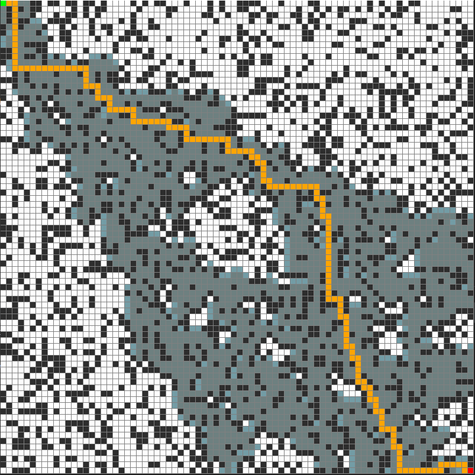

# A* Pathfinding Algorithm Visualizer

A realtime visualizer for the A* pathfinding algorithm (and Dijkstra's algorithm), built with Python + pygame.

## Overview

This project is part of a study on the A* pathfinding algorithm that I presented for the class Analysis of Algorithms at the University of New Orleans.  The study covered topics in pathfinding and graph theory, asymptotic analysis, and heuristic-guided algorithms.  

The goal of the study was to compare the performance and behavior of the A* algorithm with Dijkstra's algorithm by applying each to the task of finding the shortest path to a target tile in a series of two-dimensional grids filled with obstacle tiles.

To demonstrate the concepts that the study covered, I built a visualizer using pygame and demoed each of the algorithms live as part of the presentation.  The code for those demos is included in this repo.

----

## Project Structure

- `/demo` - Main implementation comparing A* and Dijkstra's algorithms
- `/demo_2` - Implementation that demonstrates A*'s behavior when we modify its heuristic
- `Pathfinding on a Randomized Two-Dimensional Grid.pdf` - Presentation slides

## Presentation

For a more detailed explanation of the algorithms and my analysis of the results, check out the [presentation slides](./Pathfinding%20on%20a%20Randomized%20Two-Dimensional%20Grid.pdf).
